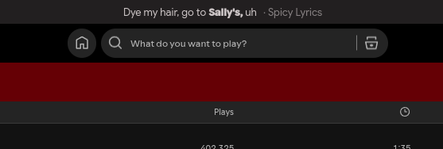

<div align="center">

# Plasma LRC (KDE Plasma 6)

<p align="center">
  <strong>Быстрый и лёгкий виджет караоке и текста песен для панели KDE Plasma 6 с поддержкой пословного синка Spicy Lyrics и стандартных LRC</strong>
</p>

[](README.md)
[](#)

<br/>

[](https://kde.org/)
[](https://www.qt.io/)
[](https://en.cppreference.com/w/cpp/17)
[](https://aur.archlinux.org/packages/plasma6-applet-lrc-git)
[](LICENSE)

<br/>



<sub><i>Пословное караоке Spicy Lyrics · Нативный парсер LRC · 0% CPU на холостом ходу · 1 запрос на трек</i></sub>

</div>

---

## Возможности

- **Пословное караоке в реальном времени**:  
  Для Spotify через Spicy Lyrics API каждое поющееся слово подсвечивается синхронно с вокалом прямо на панели задач Plasma. Слоги объединяются в целые слова без разрывов и скачков текста.
- **Кастомная палитра и цвета подсветки**:  
  Возможность задать любой HEX-цвет подсветки (`#RRGGBB`) или выбрать готовый пресет в 1 клик (Spotify Green, Cyan, Purple, Yellow, Coral, White). Стили: цвет выделения, полужирный шрифт или подчёркивание.
- **Разовая загрузка текста (1 запуск на трек вместо 900)**:  
  Вместо спама фоновыми процессами каждые 200 мс виджет считывает полный текст песни (`lrc_tty --dump` / Spicy API) ровно один раз при смене трека. Позиция интерполируется локально монотонными часами `QElapsedTimer` на C++ — нагрузка на процессор составляет 0% CPU на холостом ходу.
- **Умный MPRIS-движок**:  
  Автоматически определяет активный плеер, не лочится на браузерных вкладках (YouTube), срезает клиповый мусор из названий (`[Official Video]`, `4K`, `| Lyrics video`) и мгновенно переключается на музыку.
- **Чистая панель на паузах и проигрышах**:  
  Во время длинных гитарных соло, битов и в интро панель остаётся чистой и не держит фантомные старые строки. При остановке воспроизведения текст мягко исчезает через заданный таймер (по умолчанию 5 сек).
- **Настраиваемые клики мыши**:  
  Левый клик (окно трека / Play-Pause), средний клик колесом (ничего / Play-Pause / следующий трек).
- **Плавные визуальные переходы**:  
  Мягкая анимация затухания между строками песни без мерцания во время пословного караоке.

---

## Архитектура и как это работает

```
┌────────────────────────────────────────────────────────┐
│               MPRIS2 Media Player (D-Bus)              │
│       Spotify / Firefox / Chromium / Strawberry        │
└───────────────────────────▲────────────────────────────┘
                            │ Смена трека / Metadata / Position (400 мс)
┌───────────────────────────┴────────────────────────────┐
│                  LrcApplet (C++ Core)                  │
├────────────────────────────────────────────────────────┤
│ 1. Детекция смены трека & Скоринг активного плеера     │
│ 2. Однократный запрос лирики на трек:                  │
│    ├── Spotify + API Key  ──►  Spicy Lyrics HTTP API   │
│    └── Прочие плееры      ──►  lrc_tty --dump (1 раз)  │
│ 3. LrcParser (C++): парсинг [mm:ss.xx] в память        │
│ 4. QElapsedTimer: локальный тайминг строк и слов       │
└───────────────────────────┬────────────────────────────┘
                            │ Текст, текущее слово, прогресс
┌───────────────────────────▼────────────────────────────┐
│                 QML UI (KDE Plasma 6)                  │
│     Компактная строка на панели + Всплывающее окно     │
└────────────────────────────────────────────────────────┘
```

---

## Требования

| Компонент | Требование | Назначение |
|---|---|---|
| **KDE Plasma** | 6.0+ (KDE Frameworks 6) | Окружение рабочего стола |
| **Qt / C++** | Qt 6.5+, C++17 | Сборка бинарного плагина и QML интерфейс |
| **`lrc_tty`** | [lrc_tty](https://github.com/larsgrah/lrc_tty) | Поиск текстов в lrclib для всех MPRIS-плееров |
| **Spicy Lyrics API Key** | Необязательно | Нужен только для пословного караоке на Spotify |

---

## Установка

### Arch Linux (AUR)

```bash
yay -S plasma6-applet-lrc-git
```

### Быстрая установка скриптом

```bash
git clone https://github.com/skippingclass/plasma-lrc.git
cd plasma-lrc
./install.sh                # собрать, установить в систему и перезапустить панель
./install.sh --no-restart   # собрать и установить без перезапуска plasmashell
./uninstall.sh              # удалить виджет, плагин и настройки
```

### Сборка вручную через CMake

```bash
cmake -S . -B build -G Ninja -DCMAKE_BUILD_TYPE=RelWithDebInfo
cmake --build build
sudo cmake --install build
systemctl --user restart plasma-plasmashell.service
```

### Добавление на панель
1. Нажмите правой кнопкой мыши по панели Plasma → **«Добавить виджеты...»** (*Add Widgets*).
2. Найдите **LRC Lyrics** и перетащите на панель задач.

---

## Настройки

Правый клик по виджету на панели → **«Настроить виджет...»**:

### Вкладка «Внешний вид» (Appearance)

| Параметр | По умолчанию | Описание |
|---|---|---|
| **Поющееся слово** | `Подчёркивание` | Стиль караоке: `Подчёркивание`, `Жирный` или `Цвет выделения`. |
| **Цвет выделения** | *(Акцент KDE)* | Кастомный цвет активного слова. Кнопки-пресеты: Spotify (`#1ed760`), Cyan (`#00d4ff`), Purple (`#b342f5`), Yellow (`#ffd600`), Coral (`#ff4d4d`), White (`#ffffff`). |
| **Анимация** | `Включено` | Плавное затухание/появление текста при смене строк. |
| **Выравнивание** | `По центру` | Выравнивание текста в виджете: `По центру` или `Слева`. |
| **Режим панели** | `Стандартный` | Компактный режим оставляет на панели только текст, убирая информацию об авторе синка в окно. |
| **Макс. длина** | `0 (без ограничений)` | Ограничение длины строки в символах для экономии места на панели. |
| **Текст-заглушка** | `(пусто)` | Что отображать на панели, когда ничего не играет. |
| **Иконка** | `Включено` | Показывать ноту рядом с текстом. |

### Вкладка «Текст и синхронизация» (Lyrics)

| Параметр | По умолчанию | Описание |
|---|---|---|
| **Скрытие на паузе** | `5 секунд` | Через сколько секунд скрывать текст при паузе (0 = не скрывать). |
| **Клик ЛКМ** | `Открыть окно` | Действие по левому клику: `Открыть окно` или `Play / Pause`. |
| **Клик СКМ** | `Play / Pause` | Действие по клику колёсиком: `Ничего`, `Play / Pause`, `Следующий трек`. |
| **Сдвиг тайминга** | `0 мс` | Корректировка (−2000…+2000 мс) для спешащих или отстающих треков. |
| **Временные метки** | `Выключено` | Показывать `[mm:ss]` перед строкой. |
| **Любимый плеер** | *(пусто)* | Предпочитать этот плеер при одновременном воспроизведении (например, `spotify`). |
| **Привязать к плееру** | *(пусто)* | Работать исключительно с указанным плеером и игнорировать остальные. |
| **Игнорировать** | *(пусто)* | Список MPRIS-источников через запятую (например, плееры уведомлений). |

### Вкладка «Источники» (Source)

| Параметр | По умолчанию | Описание |
|---|---|---|
| **Spicy Lyrics** | `Включено` | Запрашивать пословные караоке-тайминги из Spicy Lyrics API для Spotify. |
| **API key** | *(пусто)* | Персональный ключ доступа к Spicy Lyrics вида `sl_sk_…`. |

---

## Настройка Spicy Lyrics (Пословное караоке)

Сервис [spicylyrics.org](https://spicylyrics.org) предоставляет пословные караоке-тайминги для треков Spotify:

1. Получите бесплатный ключ разработчика на [developers.spicylyrics.org](https://developers.spicylyrics.org).
2. Укажите ключ в настройках виджета (**Источники → API key**) или через переменную окружения:

```bash
export SPICY_LYRICS_SECRET_KEY=sl_sk_...
```

*Переменная окружения имеет приоритет над GUI-настройками и не сохраняет секретный токен в открытом виде в конфигурационных файлах KDE.*

---

## Если что-то не работает

- **Панель пустая, хотя музыка играет:**  
  Убедитесь, что `lrc_tty` установлен и видит плееры в системе:  
  ```bash
  lrc_tty --list-players
  ```  
  Если ваш плеер не определяется автоматически, укажите его имя в поле **Любимый плеер** (например, `spotify` или `chromium`).
- **Слова не подсвечиваются пословно:**  
  Пословная подсветка доступна для Spotify через Spicy Lyrics. Для остальных источников (lrclib) текст синхронизируется построчно.
- **Слова спешат или отстают от звука:**  
  Откройте настройки виджета → вкладка **Текст** → настройте ползунок **Сдвиг тайминга** (вправо — задержка, влево — опережение).

---

## Лицензия

Распространяется под лицензией [MIT](LICENSE).
